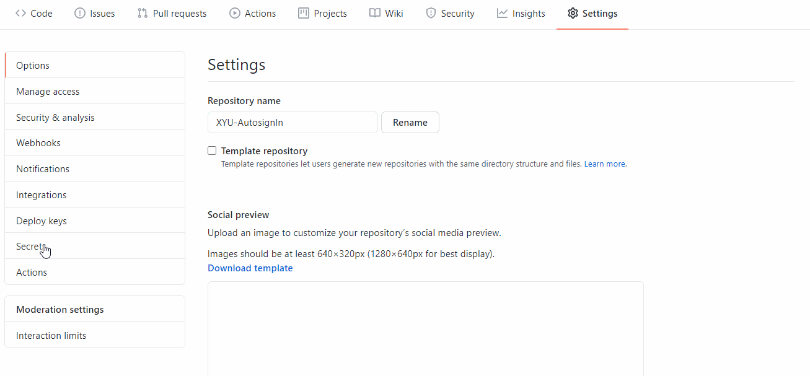
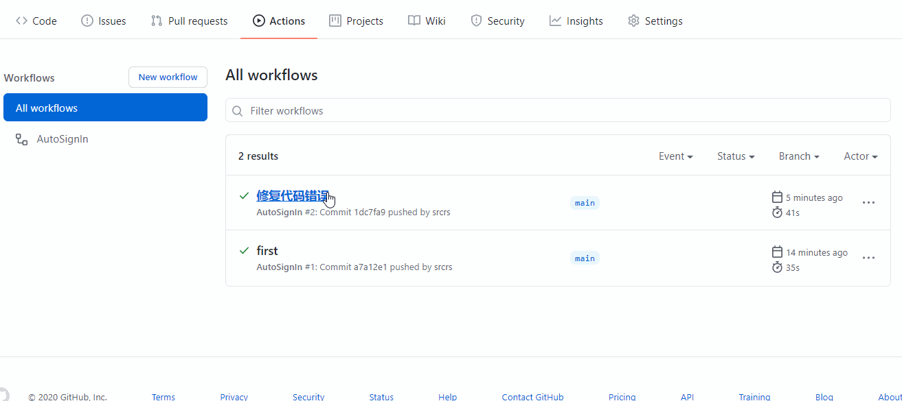

<div align="center"> 
<h1 align="center">信阳学院完美校园签到</h1>


</div>

# 简介

信阳学院完美校园每日自动签到，从此让你解放双手，支持多用户批量签到。

# 功能

- 完美校园签到

- 支持多用户批量签到

- 支持推送运行结果至微信(使用`server`酱)

- 随机温度，随机经纬度(在合适的范围内)

# 使用方法

## 准备

- 完美校园`APP`账号(需要手机号和密码,若未使用过，需在健康打卡页面完善个人信息)

- 监护人手机号

- 若需推送至微信，请注册`server`酱，并获取其`SCKEY`

## 1.fork本项目

## 2.开启antions(默认你的actions是处于禁用状态)


## 3.将个人信息添加至Secrets

Name | Value
-|-
USERS | 手机号,密码,监护人手机号,SCKEY

多用户的`Value`格式如下：

```sh
手机号1,密码1,监护人手机号1,SCKEY
手机号2,密码2,监护人手机号2,
手机号3,密码3,监护人手机号3,
                    .
                    .
                    .
```

如需使用 [server酱](http://sc.ftqq.com/) 推送至微信，按照官网教程注册，获取其`SCKEY`。只需要在第一个用户的后面添加即可。

如不需请留空，注意不要将其前面的`,`删除了。



## 4.第一次运行actions

只需要一个`push`操作就会触发`actions`运行

将项目`poinMe.txt`文件中的`flag`值由`0`改为`1`即可。

```patch
- flag: 0
+ flag: 1
```



## 大功告成

以后每天会在8:30进行自动签到。

## 参考项目

[HAUT_autoCheck](https://github.com/YooKing/HAUT_autoCheck)

[wanmei_campus](https://github.com/zhongbr/wanmei_campus)
